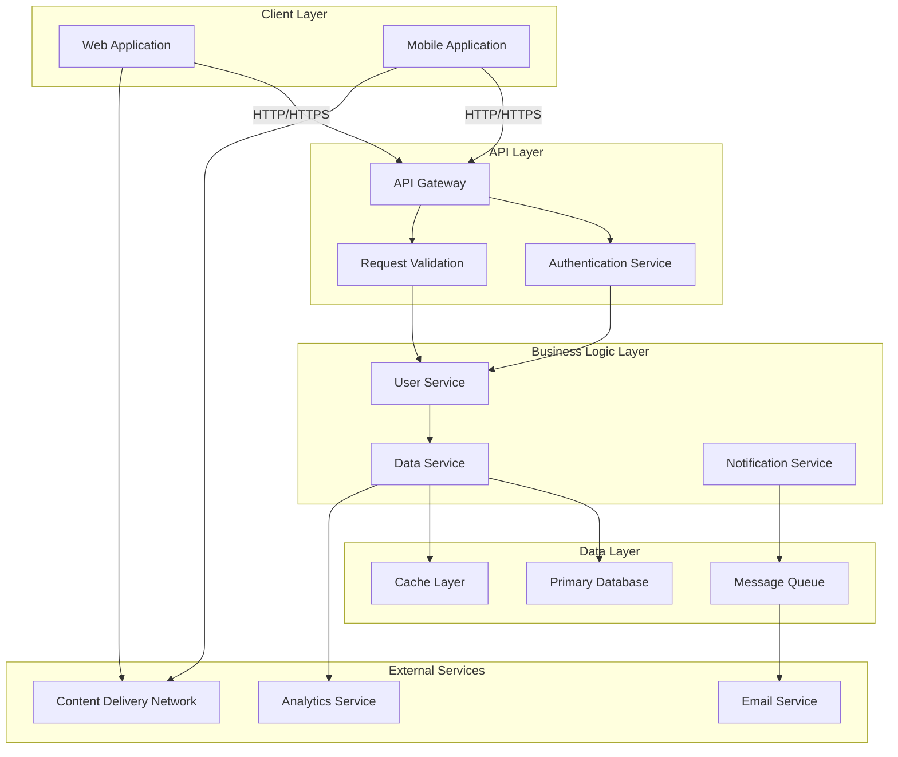

# Architecture Overview

This document provides a high-level overview of the system architecture.

## System Architecture Diagram

## Component Descriptions

### Client Layer
- **Web Application**: Frontend web interface for desktop users
- **Mobile Application**: Native or cross-platform mobile application

### API Layer
- **API Gateway**: Routes and manages all incoming API requests
- **Authentication Service**: Handles user authentication and authorization
- **Request Validation**: Validates incoming requests against business rules

### Business Logic Layer
- **User Service**: Manages user profiles and user-related operations
- **Data Service**: Core business logic for data processing and retrieval
- **Notification Service**: Handles sending notifications and alerts

### Data Layer
- **Primary Database**: Main persistent data storage
- **Cache Layer**: In-memory caching for performance optimization
- **Message Queue**: Asynchronous message handling for decoupled services

### External Services
- **Email Service**: Third-party email delivery service
- **Analytics Service**: User and system analytics tracking
- **Content Delivery Network**: Fast content distribution and static file serving

## Data Flow

1. Clients submit requests through the API Gateway
2. Requests are authenticated and validated
3. Business logic services process the requests
4. Data is persisted or retrieved from the data layer
5. External services are invoked asynchronously when needed
6. Responses are returned to the client

## Technology Stack

This architecture supports multiple technology implementations and can be deployed in containerized environments using orchestration platforms like Kubernetes.